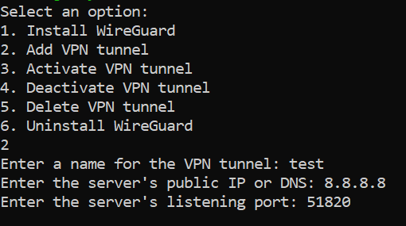

# WireGuard Manager Script

This script simplifies the management of WireGuard VPN tunnels on various Linux distributions. It provides an easy-to-use interface for installing or uninstalling WireGuard, adding, activating, deactivating, and deleting VPN tunnels.

## Features

- Automated WireGuard installation on multiple Linux distributions.
- Add new VPN tunnel configurations.
- Activate existing VPN tunnels.
- Deactivate active VPN tunnels.
- Delete existing VPN tunnel configurations.
- Automated WireGuard uninstallation on multiple Linux distributions.

## Prerequisites

- Root privileges are required to run this script.

## Supported Distributions

The script is compatible with the following Linux distributions:

- Ubuntu, Debian, Linux Mint, Elementary OS, Zorin OS, Kali Linux
- Fedora, CentOS, RHEL, CentOS Stream, Mageia, Fedora Workstation, Fedora Server, Fedora Silverblue, Clear Linux, Calculate Linux, Sabayon
- Arch Linux, Manjaro, Antergos, EndeavourOS, BlackArch Linux, Trisquel, Void Linux, NixOS
- openSUSE, Solus, MX Linux, Puppy Linux, Alpine Linux, Parrot OS, Tails, Slax, Peppermint OS, Bodhi Linux, SystemRescueCd, CRUX, GhostBSD, TrueOS, Project Trident, OpenBSD, FreeBSD

## Usage

1. Clone the repository to your system:

   ```sh
   git clone https://github.com/your-username/wireguard-vpn-script.git

3. Navigate to the script directory:

   ```sh
   cd Wireguard-Manager-Script 

4. Add executable permission:

   ```sh
   sudo chmod +x main.sh

5. Run the script with root privileges:

   ```sh
   sudo bash main.sh

6. Follow the on-screen prompts to manage your VPN tunnels.



## Disclaimer

This script is provided as-is and might require adjustments for specific distribution versions or package managers.
    Use this script responsibly and at your own risk. Always review and test scripts before deploying on production systems.
    Securely handle private keys and network configurations. Adhere to best security practices.

## Contributing

Pull requests are welcome. For major changes, please open an issue first
to discuss what you would like to change.

Please make sure to update tests as appropriate.

## License

[MIT](https://choosealicense.com/licenses/mit/)
